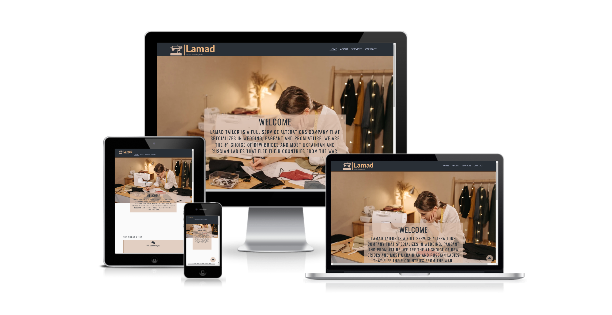
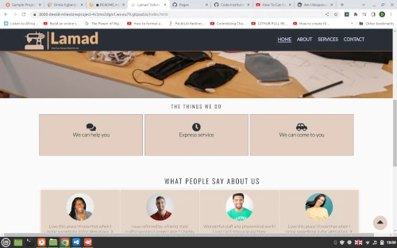
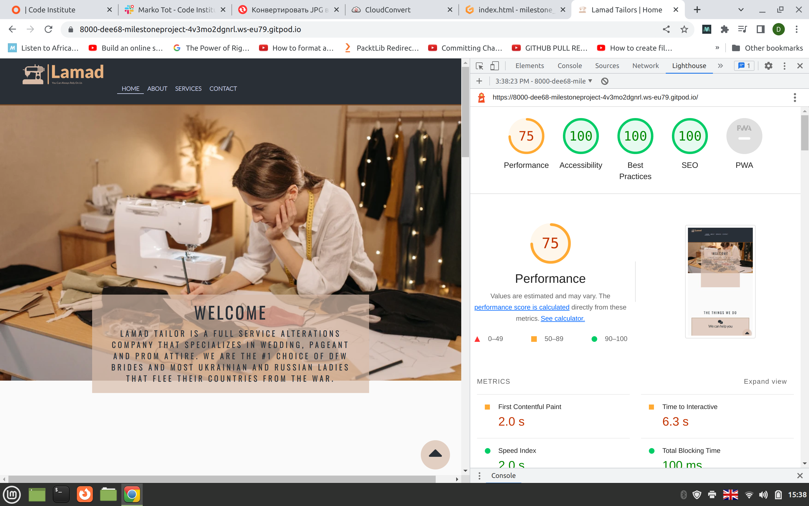

# Lamad
The Lamad website is a tailoring website that is the dream of a group of Ukrainian ladies that aspires to show off their talents by rendering tailoring services in Cahersiveen. Lamad offers services not only to people in cahersiveen but also nearby towns such as Balle Skellig,Port Magee and it environs.


Users of this website will be able to find all the information they need to know about Lamad:Buisness hours, services and contact information.This site is targeted towards anyone that is in need of a unique dress or needs dress to be altered.




## Features
- Navigation

    - Featured at the top of the page,the navigation shows the logo image with the name at the left upper corner which links to the home page.
    - The other navigation links are to the right: Home, About, Services and Contact which links to different corresponding pages.
    - The navigation is in a font and color that contrasts the background.
    - The navigation clearly tells the user the name of the tailoring website and makes the information of different pages easy to find.
#
## Logo     About      Services       Contact

## Testing
- I tested that this page works in different browsers : Chrome, Firefox and Safari
- I confirmed that the navigation, header, about, services and contact pages all have readable texts and are easy to understand.
- I have confirmed that the form works correctly validating all input elements and the submit button works.

### Bugs
#### Solved bugs
- When I tested my web pages with lighthouse I discovered that the upload time of the pages was very slow.
- I discovered that this was due to the size of the images.
- Reducing the size and converting the images to a more modern web format(.webp) fixed the problem.
- In my contact page I embedded google map but had issues with setting the width of the obsolete iframe.
```
<iframe src="https://www.google.com/maps/embed?pb=!1m18!1m12!1m3!1d2459.2640832509846!2d-10.228465123398758!3d51.947375571916716!2m3!1f0!2f0!3f0!3m2!1i1024!2i768!4f13.1!3m3!1m2!1s0x484ff31ceb50d033%3A0xbf4459f40fc381a4!2sSkellig%20Accommodation%20Centre!5e0!3m2!1sen!2sie!4v1670701740436!5m2!1sen!2sie" title="Lamad tailors Cahersiveen" allowfullscreen width="100%" height="700" ></iframe>
```
- Adding a parent div to the iframe and enabling the iframe to get its width and height from the parent solved the problem.

### Validator Testing
- HTML
  - No errors were returned when passing through the official [W3C validator](https://validator.w3.org)
  
  
  
  
- CSS
  - No errors were returned when passing through the official [CSS Valdation Service](https://jigsaw.w3.org/css-validator/)
  

## Google Developer Tools
- I made use of the built-in **Chrome Dev Tools** to experiment and debug while coding, in addition to testing simulated responsive behaviour across a wide range of mobile and desktop devices, and finally checking all pages Performance using **Lighthouse**.

- I spent too much time trying to improve the performance of my pages, eventually changed all the images to .webp format.


- Accessibility
  - I confirmed that the colors and fonts chosen are easy to read accessible by running through lighthouse in devtools.


### Unfixed Bugs
No unfixed bugs

# Deployment
- The site was deployed to Github pages. The steps to deploy are as follows: 
  - In the Github pages, navigate to the settings tab
  - From the source section drop-down select the Main Branch
  - Once the main branch has been selected it provides link to the website.


  The live link can be found here [Lamad](https://dee68.github.io/milestone_project1/)

# Credits
## Content
- The code to make an accordion was taken from [W3schools Accordion](https://www.w3schools.com/howto/howto_js_accordion.asp)
- The code to make the footer was taken from the CI [Love Running](https://dee68.github.io/love-running/) project.
- All icons on the pages where taken from [FontAwesome](https://fontawesome.com)

## Media
- The logo in the header was made from [Free Logo Maker](https://logo.com/)
- All images on the web pages are taken from [Pexels](https://www.pexels.com/ru-ru/)


